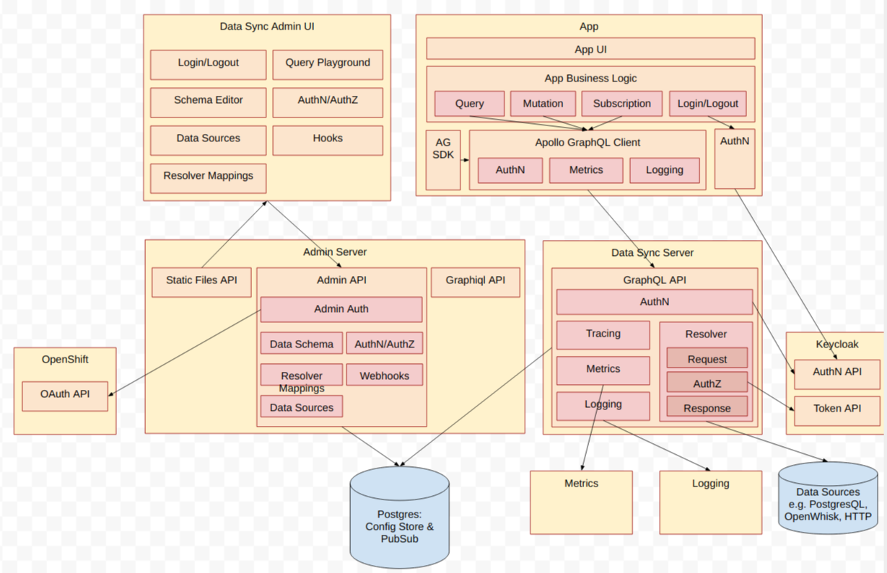

# aerogear-data-sync-server

GraphQL based data sync server for mobile, with backend integration capabilities

[](https://standardjs.com)

## Trying it out

```
npm i
npm run start-dev
```

To run normally (not dev), you'll need to specify some env vars and config files.
There are samples in the repo used by the `start-dev` script above.

```
SCHEMA_FILE=./schema.graphql.sample npm start
```

The graphql endpoint is at `/graphql`.
The subscriptions websocket is at `/subscriptions`.

## Architecture

The baseline architecture is shown below:



1. The developer defines the GraphQL Data Schema required for their App. This is done in the Data Sync Server UI, or done outside the UI and uploaded later
2. The developer generates typed Models for use in their App based on the schema defined. Basic typed CRUDL query structures will also be generated for use in the App
3. The developer executes queries and mutations in their App, which uses the Apollo GraphQL client to talk to the server. The Apollo GraphQL Client is auto configured by the AeroGear SDK e.g. it knows what the Data Sync Server url is.
4. The Data Sync Server understands queries and mutations for basic CRUDL operations, and executes a dynamic resolver that interacts with the underlying data store i.e. PostgreSQL 

Although this architecture is very limited compared to the full scope of features available with GraphQL, it is only a starting point.
The ultimate goal would see some of the following being possible too:

* define custom queries, resolvers & mappings via the UI
* authentication and authorisation capabilities via OpenID & Keycloak
* offline first capabilities for executing mutations on device while offline
